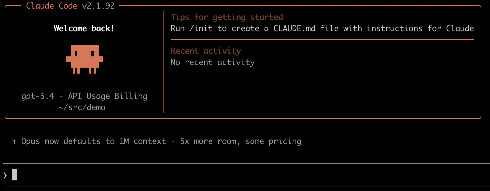
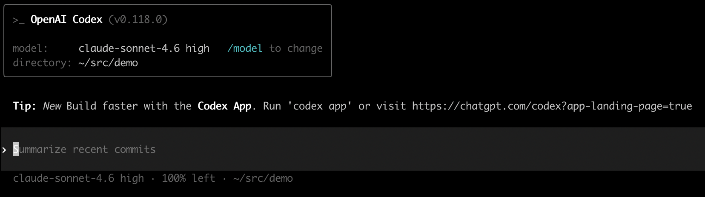
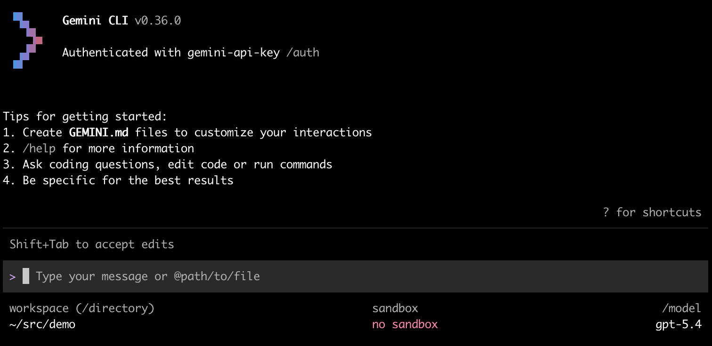
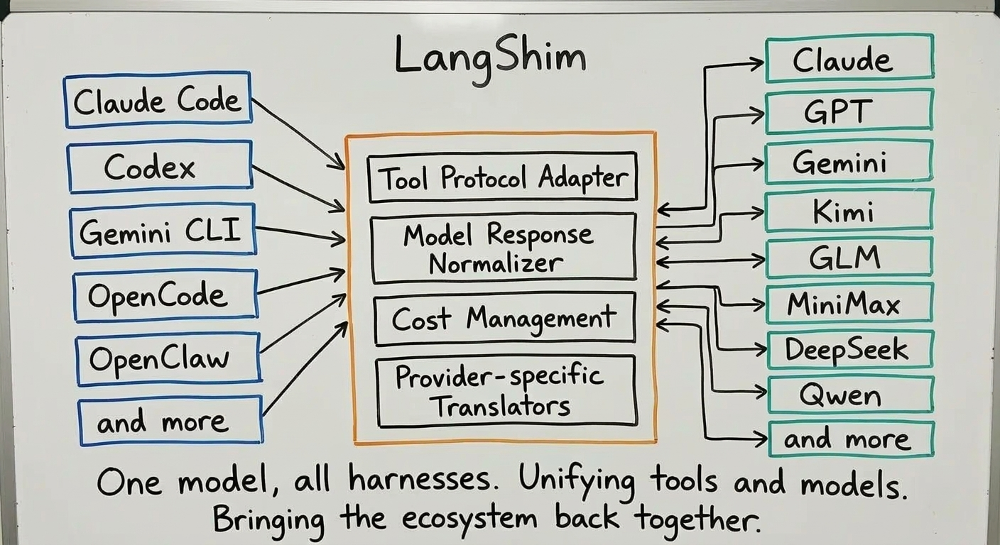

# LangShim

[简体中文](README_CN.md)

> A lightweight local LLM gateway for routing requests across multiple providers with unified auth and usage tracking.

`LangShim` is a Rust-based API gateway that sits between local clients and upstream LLM providers. It exposes OpenAI / Anthropic / Gemini compatible endpoints, translates request/response formats where needed, and centralizes gateway authentication and usage logging.


## ✨ Highlights

- 🧩 Protocol translation between Anthropic Messages, OpenAI Chat Completions, OpenAI Responses, and Google Gemini
- 🔀 Multi-provider routing across OpenAI, Anthropic, OpenRouter, DeepSeek, Aliyun, Moonshot, Amazon, Google, and more
- 🌊 Streaming support with SSE forwarding and usage accounting







## 🚦 Quick Start

### Install

Install prebuilt binaries via shell script (Linux / macOS):

```bash
curl --proto '=https' --tlsv1.2 -LsSf https://github.com/langshim/langshim/releases/download/v0.1.0/langshim-installer.sh | sh
```

Install prebuilt binaries via PowerShell script (Windows):

```powershell
powershell -ExecutionPolicy Bypass -c "irm https://github.com/langshim/langshim/releases/download/v0.1.0/langshim-installer.ps1 | iex"
```

### Configure

Create `~/.langshim/models.json` (or `$LANGSHIM_HOME/models.json`). You can start from the example:

```bash
mkdir -p ~/.langshim
cp models.example.json ~/.langshim/models.json
```

Each model entry defines pricing and transport details. Example:

```json
{
  "transport": {
    "provider": "google",
    "protocol": "gemini",
    "model_id": "gemini-3-flash-preview",
    "base_url": "https://generativelanguage.googleapis.com",
    "api_key": "AIza..."
  }
}
```

### Run

```bash
langshim serve
```

The server listens on `127.0.0.1:3000` by default, with API key `secret`.
By default, USD/CNY conversion uses a fixed `6.9` exchange rate and does not fetch live rates.

Command-line flags are also supported:

```bash
langshim --api-key secret --port 3000 serve
langshim --live-exchange serve
langshim usage --month 2026-03
```

If both command-line flags and environment variables are provided, command-line flags take precedence.

### Harness Configuration Reference

Using `github.com/farion1231/cc-switch` generally provides a better experience. However, `cc-switch` may lag behind Codex's rapid iteration, so some settings might not take effect in newer versions.

#### Claude Code

Tested with Claude Code `2.1.92`; using `cc-switch` is recommended.

```
$ cat ~/.claude/settings.json
{
  "env": {
    "ANTHROPIC_AUTH_TOKEN": "secret",
    "ANTHROPIC_BASE_URL": "http://localhost:3000",
    "ANTHROPIC_DEFAULT_HAIKU_MODEL": "gpt-5.4-mini",
    "ANTHROPIC_DEFAULT_OPUS_MODEL": "gpt-5.4",
    "ANTHROPIC_DEFAULT_SONNET_MODEL": "gpt-5.4",
    "ANTHROPIC_MODEL": "gpt-5.4",
    "ENABLE_TOOL_SEARCH": false
  }
}
```

#### Codex

Tested with `codex-cli 0.118.0`.

```
$ cat ~/.codex/config.toml
model = "claude-sonnet-4.6"
model_provider = "langshim"

[model_providers.langshim]
name = "LangShim"
wire_api = "responses"
requires_openai_auth = true
supports_websockets = false
base_url = "http://localhost:3000/v1"

$ cat auth.json
{
  "OPENAI_API_KEY": "secret",
  "auth_mode": "apikey"
}
```

#### Gemini

Tested with `gemini-cli 0.36.0`; using `cc-switch` is recommended.

```
$ cat ~/.gemini/.env
GEMINI_API_KEY=secret
GEMINI_MODEL=gpt-5.4
GOOGLE_GEMINI_BASE_URL=http://localhost:3000
```

### Usage reports

```bash
# Last 15 days, grouped by day (default)
langshim usage

# Specify date range
langshim usage daily --from 2026-03-01 --to 2026-03-15

# Monthly summary for a specific month
langshim usage monthly --month 2026-03
```

### Environment variables

| Variable | Required | Description | Default |
|----------|----------|-------------|---------|
| `LANGSHIM_API_KEY` | No | Local auth token for incoming requests | `secret` |
| `LANGSHIM_HOME` | No | Local data root, defaults to `~/.langshim` | `~/.langshim` |
| `LANGSHIM_PORT` | No | HTTP listen port | `3000` |

`--live-exchange` enables startup and daily refresh of the USD/CNY rate from Frankfurter.

## 🏗️ How It Works



## 🔌 API Surface

### Anthropic-compatible endpoints

| Endpoint | Method | Description |
|----------|--------|-------------|
| `/v1/messages` | `POST` | Send messages for completion |
| `/v1/messages/count_tokens` | `POST` | Count tokens for a message |

### OpenAI-compatible endpoints

| Endpoint | Method | Description |
|----------|--------|-------------|
| `/v1/chat/completions` | `POST` | Chat completions |
| `/v1/responses` | `POST` | OpenAI Responses API |

### Google Gemini-compatible endpoints

| Endpoint | Method | Description |
|----------|--------|-------------|
| `/v1beta/models/{model}:generateContent` | `POST` | Generate content (non-streaming) |
| `/v1beta/models/{model}:streamGenerateContent` | `POST` | Generate content (streaming) |

## 🧠 Transport Protocols

`transport.protocol` currently supports:

- `bedrock`
- `gemini`
- `anthropic`
- `openai`
- `openai-responses`

### Support matrix

| Client endpoint | Request shape | `bedrock` backend | `gemini` backend | `anthropic` backend | `openai` backend | `openai-responses` backend |
|----------|----------|------------------|------------------|------------------|---------------|-------------------------|
| `/v1/messages` | Anthropic Messages | ✅ | ✅ | ✅ | ✅ | ✅ |
| `/v1/chat/completions` | OpenAI Chat Completions | ✅ | ✅ | ✅ | ✅ | ✅ |
| `/v1/responses` | OpenAI Responses | ✅ | ✅ | ✅ | ✅ | ✅ |
| `/v1beta/models/{model}:generateContent`<br>`/v1beta/models/{model}:streamGenerateContent` | Google Gemini | ✅ | ✅ | ✅ | ✅ | ✅ |

### Important compatibility notes

- `bedrock` has native passthrough support on `/v1/messages`; `/v1/chat/completions` and `/v1/responses` are handled through Anthropic-compatible translation chains
- `gemini` uses the Gemini REST API endpoints: `/v1beta/models/{model}:generateContent`, `/v1beta/models/{model}:streamGenerateContent?alt=sse`, and `/v1beta/models/{model}:countTokens`
- `openai-responses` currently has native passthrough support only on `/v1/responses`
- "Supported" means the gateway has a code path for that combination
- Field-level compatibility for tools, reasoning, image input, and vendor-specific extensions can still vary by upstream provider

## 🧪 Testing

```bash
cargo test
```

Notes:

- Unit tests cover selected protocol rules and adapter translation logic

## 📌 Project Notes

- This project works out of the box with local API key auth, model routing, and usage logging
- Incoming auth is matched against local `API_KEY` via `Authorization: Bearer ...`, `x-api-key`, or `x-goog-api-key`
- If you plan to adopt this as a generic public gateway, you will typically need to customize it for your multi-tenancy, permission, and deployment model

## 🤝 Contributing

Issues and pull requests are welcome. If you plan to add a new provider or protocol mapping, we recommend documenting the request/response compatibility boundaries, which will make it easier for others to integrate with the project.

## 📄 License

MIT, see [LICENSE](LICENSE).
